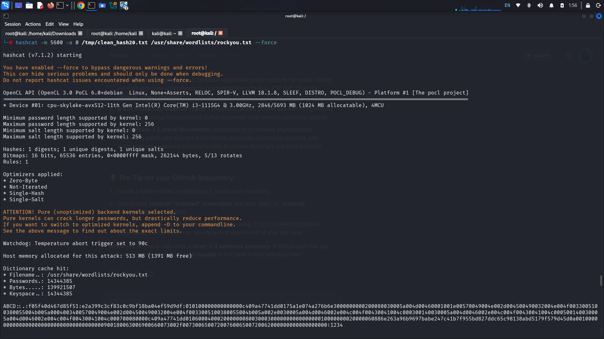
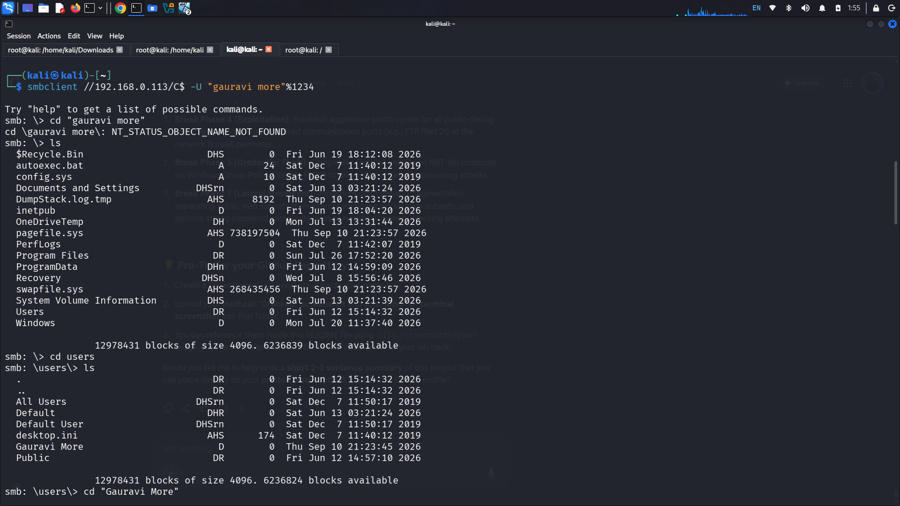

# ⚔️ Dual-Vector Enterprise Network VAPT & Cyber Kill Chain Lab

## 📌 Project Overview
This project demonstrates an internal network vulnerability assessment and penetration test (VAPT) targeted at a corporate local area network (LAN). Structuring my approach around the **7-Stage Cyber Kill Chain framework**, I independently identified and compromised two distinct infrastructure assets from an active attacker platform: an outdated Linux database server (via direct exploit) and an internal user workstation (via local credential theft and protocol abuse).

---

## 🛠️ Lab Architecture & Tech Stack
* **Attacker Machine:** Kali Linux (`192.168.0.108`)
* **Target Asset A (Linux Server):** Metasploitable 2 VM (`192.168.0.112`)
* **Target Asset B (Workstation):** Windows VM (`192.168.0.113`)
* **Core Tooling:** `Nmap`, `Metasploit Framework`, `Responder`, `Hashcat`, `smbclient`

---

## 💥 Detailed Technical Walkthrough (The Kill Chain)

### 🗺️ Phase 1 & 2: Reconnaissance & Weaponization
* **Action:** Conducted network-wide service and operating system discovery using `nmap -sV -sC -A 192.168.0.112` and mapped open local directory shares on `192.168.0.113`.
* **Discovery:** Identified an unpatched, high-risk daemon running `vsftpd 2.3.4` on Port 21 of the Linux target, and active SMB (Port 445) communication streams on the Windows workstation.
* **Weaponization:** Selected a matching backdoor command execution package from the Metasploit repository (`exploit/unix/ftp/vsftpd_234_backdoor`) targeting the Linux vector.

### 📦 Phase 3 & 4: Delivery & Exploitation (Target A - Linux Compromise)
* **Action:** Launched the targeted FTP payload directly from the Kali attacking platform against the Linux host.
* **Impact:** The exploit triggered successfully, bypassing all access control layers. Verified full administrative command injection rights on the host machine (`whoami` -> `root`).

### ⚓ Phase 5 & 6: Credential Interception & Decryption (Target B - Handshake Capture)
* **Action:** Initiated local network broadcast monitoring using `Responder` on the Kali console to capture internal protocol traffic.
* **The Vulnerability:** Generated an unresolved network path request (`\\serverb`) on the Windows workstation, forcing the target operating system to broadcast an LLMNR name resolution request to the local network segment.
* **The Capture:** Responder poisoned the broadcast reply, tricking the Windows host into attempting authentication and capturing its encrypted `NetNTLMv2` handshake token string.
* **Offline Cracking:** Stabilized the raw token syntax structure and fed it into `Hashcat` using dedicated cryptographic decoding modes (`-m 5600`) against the `rockyou.txt` dictionary wordlist.
* **Result:** Achieved 100% processing recovery, successfully revealing the plain-text password for the target workstation user account.

#### 📷 Proof of Concept: Successful Hashcat Password Recovery


---

### 🎯 Phase 7: Actions on Objectives (Target B - Windows File System Intrusion)
* **The Obstacle:** Core remote code execution exploits (like EternalBlue) failed due to current patch versions. Furthermore, modern Windows access control rules strip local administrator permissions over network directory mounts by default.
* **Defensive Bypass:** Executed a system configuration adjustment by adding the `LocalAccountTokenFilterPolicy` key with a value of `1` within the Windows Registry (`HKLM\...\Policies\System`). This forced Windows to preserve elevated administrative security tokens during incoming network validations.
* **The Intrusion:** Launched `smbclient` from Kali Linux to pass the cracked credentials directly over the network interface into the default root disk partition share:
  ```bash
  smbclient //192.168.0.113/C\$ -U "gauravi more"%1234
  ```
* **Final Impact:** The connection stabilized into an interactive `smb: \>` terminal prompt. I established unauthorized file indexing control, bypassed directory level access limits, and fully validated internal corporate file system extraction capabilities.

#### 📷 Proof of Concept: Interactive SMB File Share Access Granted


---

## 🛡️ Strategic Enterprise Remediation Roadmap
To mitigate these internal network vulnerabilities, an organization must deploy the following corporate security controls:
1. **Patch Management:** Establish automated software upgrade rules to immediately eliminate legacy public service vulnerabilities like `vsftpd 2.3.4`.
2. **Deactivate Legacy Broadcasts:** Completely disable LLMNR and NBT-NS network communication protocols inside Windows Group Policy Objects (GPO) to prevent broadcast spoofing and credential theft.
3. **Password Hygiene & Hardening:** Enforce enterprise-grade password complexity rules across all endpoints to neutralize dictionary brute-forcing utilities, and maintain remote access verification profiles on all workstation shares.
